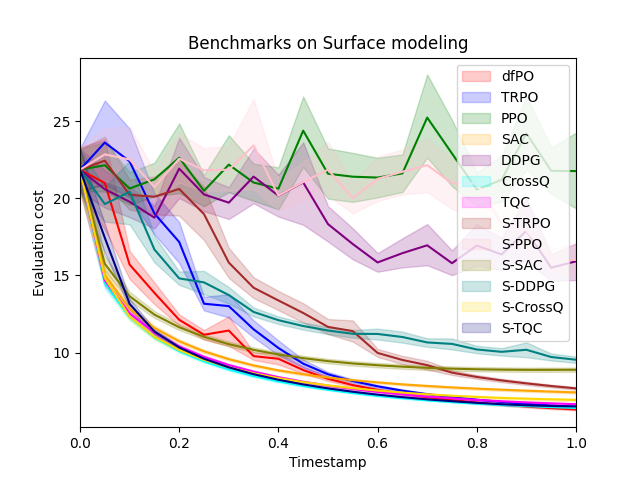
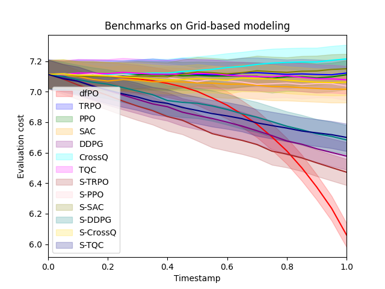
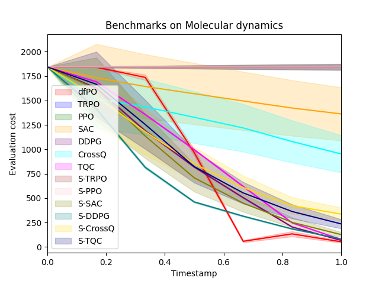

# Differential Reinforcement Learning

[](./LICENSE)

## Introduction
- **Differential Reinforcement Learning (Differential RL)** is a framework that recasts RL from the lens of continuous-time optimal control. Instead of optimizing cumulative returns via value/Q functions, we derive a **differential dual** using Pontryagin’s maximum principle and work in a **Hamiltonian phase space** over state–adjoint variables. This induces a policy as a **trajectory operator** $G = \mathrm{Id} + \Delta_t\, S \nabla g$ that advances the system along dynamics aligned with a reduced Hamiltonian. The result is a learning process that embeds **physics-informed priors** and promotes **trajectory consistency** without hand-crafted constraints.

- Within this framework, we instantiate a stage-wise algorithm called **Differential Policy Optimization (dfPO)** that learns the local movement operator pointwise along the trajectory. The method emphasizes **local, operator-level updates** rather than global value estimation. Theoretically, the framework yields **pointwise convergence guarantees** and a **regret bound of $O(K^{5/6})$**. Empirically, across representative scientific-computing tasks (surface modeling, multiscale grid control, molecular dynamics), Differential RL with dfPO achieves strong performance in low-data and physics-constrained scientific settings.
---

### Key Features

- **Differential RL Framework:** Optimizes local trajectory dynamics directly, bypassing cumulative reward maximization.
- **Pointwise Convergence:** Theoretical convergence guarantees and sample complexity bounds.
- **Physics-Based Learning:** Performs well in tasks realted to scientific computing.

---

## Experiments

For experiments and benchmarkings, we designed tasks to reflect critical challenges in scientific modeling:

1. **Surface Modeling**  
   Optimization over evolving surfaces, where rewards depend on the geometric and physical properties of the surface.

2. **Grid-based Modeling**  
   Control on coarse grids with fine-grid evaluations, representative of multiscale problems with implicit rewards.

3. **Molecular Dynamics**  
   Learning in graph-based atomic systems where dynamics depend on nonlocal interactions and energy-based cost functionals.

## 📦 Setup Instructions
### 1. Clone the repo and install dependencies

```bash
git clone https://github.com/mpnguyen2/dfPO.git
cd dfPO
pip install -r requirements.txt
```

### 2. Install trained models for benchmarking
Due to size constraints, two folders ```models``` and ```benchmarks/models``` are not in the repo. Download them here:

📥 First download two folders ```models``` and ```benchmarks/models``` from the Dropbox link: https://www.dropbox.com/scl/fo/n4tuy2jztqbenrh59n21l/AGOdr_YHHEo3pgBF6G39P38?rlkey=g65hut0hi53sodmwozpoidb7k&st=9y7fdnf8&dl=0.

Put the model files inside those two folders into corresponding directories from the root directory:
```
dfpo/
├── models/
├── benchmarks/
│   └── models/
```

## Benchmarking Results
### Sample Size
- ~100,000 steps for Surface modeling and Grid-based modeling
- 5,000 steps for Molecular dynamics due to expensive evaluations

## 🔁 Reproducing Benchmarks

To reproduce the benchmark performance and episode cost plots, run:

```bash
python benchmarks_run.py
```

Our benchmarking includes 13 algorithms, covering both standard and reward-reshaped variants for comprehensive evaluation.

### Benchmark Summary (mean final evaluation cost)

| Algorithm     | Surface modeling | Grid-based modeling | Molecular dynamics |
|---------------|------------------|----------------------|---------------------|
| DPO           | **6.32**         | **6.06**             | **53.34**           |
| TRPO          | 6.48             | 7.10                 | 1842.28             |
| PPO           | 20.61            | 7.11                 | 1842.31             |
| SAC           | 7.41             | 7.00                 | 1361.31             |
| DDPG          | 15.92            | 6.58                 |**68.20**            |
| CrossQ        | **6.42**         | 7.23                 | 923.90              |
| TQC           | 6.67             | 7.12                 | 76.87               |
| S-TRPO        | 7.74             | **6.48**             | 1842.30             |
| S-PPO         | 19.17            | 7.05                 | 1842.30             |
| S-SAC         | 8.89             | 7.17                 | 126.73              |
| S-DDPG        | 9.54             | 6.68                 | 82.95               |
| S-CrossQ      | 6.93             | 7.07                 | 338.07              |
| S-TQC         | 6.51             | 6.71                 | 231.98              |


### Evaluation costs over time steps across different episodes are shown in:

<div align="center">
  
  
  
</div>


For statistical analysis performance over 10 seeds, you can run:
```bash
python benchmarks_run.py --multiple_seeds=1
```

## File structure
```
dfPO/
├── output/                  # Benchmark plots and evaluation costs
├── models/                 <- Download this folder from the given link above
├── benchmark/               # Benchmark code
│   └── models/             <- Download this folder from the given link above
├── *.py                     # Python Source code
├── benchmarks_run.py        # Runs all experiments
└── README.md
└── main.ipynb               # DPO training notebook
└── analysis.ipynb           # Misc analysis notebook (model size, stat analysis)
```
